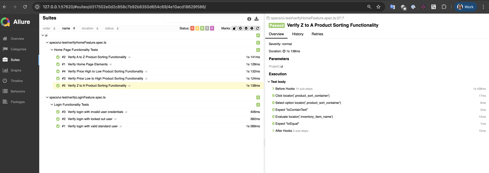

# Playwright UI & API Automation Framework

This project demonstrates how to use **Playwright** to automate Web application and API testing using **Typescript (Node.js)**. It follows the **Page Object Model (POM)** for better maintainability and scalability.


## Project Information
- **Project:** SauceDemo Application & PetStore API Testing  
- **Prepared By:** Rochelle Abeywickrama 
- **Tools:** Playwright & TypeScript 
- **Design Pattern:** Page Object Model (POM), Data-driven + fixtures 
- **Reporting:** Playwright HTML Reporter + Allure 
- **Applications Under Test:**  
  - [SauceDemo UI Application](https://www.saucedemo.com/)  
  - [Petstore API Collection](https://petstore.swagger.io/#/)
- **Key Advantages:**  
    - Reusable Page Objects for UI elements
    - Consistent API request handling
    - Easy CI/CD integration
    - Clear separation of test data, page objects, and tests


### Project Structure:
```text
src/
   docs/                     << Project docs
   utils/                    << Helpers, Postman collection

tests/                      
   pageObject/               << Page objects
   fixtures/                 << Test data
   specs/                    << UI & API Test scripts

playwright-report            << Playwright HTML report
allure-report                << Allure report
package.json                 << Packages and Dependencies
playwright.config.ts         << Project configuration
```


## 📌 Prerequisites

Ensure you have the following installed on your system:

- [Node.js](https://nodejs.org/) (v16+ recommended)
- [Npm](https://docs.npmjs.com/downloading-and-installing-node-js-and-npm) (as package manager)
- [VSCode](https://code.visualstudio.com/download) or any prefered IDE


Also, refer to naming standards [naming conventions for project](src/docs/naming-standards.md)


---

## 🚀 Installation & Setup

1. **Clone the Repository**
   ```sh
   git clone https://github.com/RochelleAbeywickrama/playwright-ui-api-test.git
   ```

2. **Install Dependencies**
   ```sh
   npm install
   ```

---

## ▶️ Running Tests

Use following commands to run tests in different configurations:

   ```sh
   #To execute the UI tests:
   npm run run:ui:test
   
   #To execute the API:
   npm run run:api:test
   ```

---

## 📊 Test Results & Reporting

Generate Allure report locally:
   ```sh
   npm run allure:report
   ```




## 🔗 Reference

**Reading materials & Downloads:**

- [Playwright Docs](https://playwright.dev/docs/intro)
- [Playwright Best Practices](https://playwright.dev/docs/best-practices)
- [Playwright Video Guides](https://www.youtube.com/@Playwrightdev)
- [VSCode Download](https://code.visualstudio.com/download)
- [Configure Allure Reporting](https://allurereport.org/docs/playwright/)
- [Setting up CI](https://playwright.dev/docs/ci-intro)


---

Happy Testing! 🚀